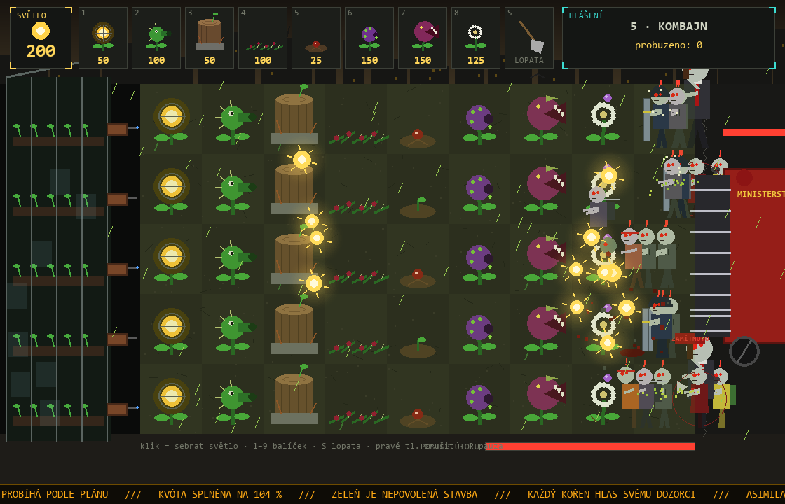

# Games

Hry naprogramované s pomocí Clauda.

| Hra | Popis | Spuštění |
|-----|-------|----------|
| [KVÓTA](KVOTA/) | Dystopická hra s padajícími bloky, solo i LAN souboj pro 2 hráče | Python 3.8+ → `KVOTA/HRAT.bat` |
| [ZÁHON](ZAHON/) | Dystopická obrana skleníku: 5 úrovní s bossem, tajná puzzle úroveň, nekonečný režim, LAN souboj kytky vs. zombie ve 4 módech | Python 3.8+ → `ZAHON/HRAT.bat` |
| [APEX Kasino](apex-kasino/) | Budovatelská hra: z malé herny kasino s pěti hvězdami, patra, personál a režim CEO (C#, WinForms) | Windows → `apex-kasino/build.cmd`, pak `APEX Kasino.exe` |

## Jak stáhnout
Zelené tlačítko **Code → Download ZIP**, nebo sekce **Releases** vpravo.
